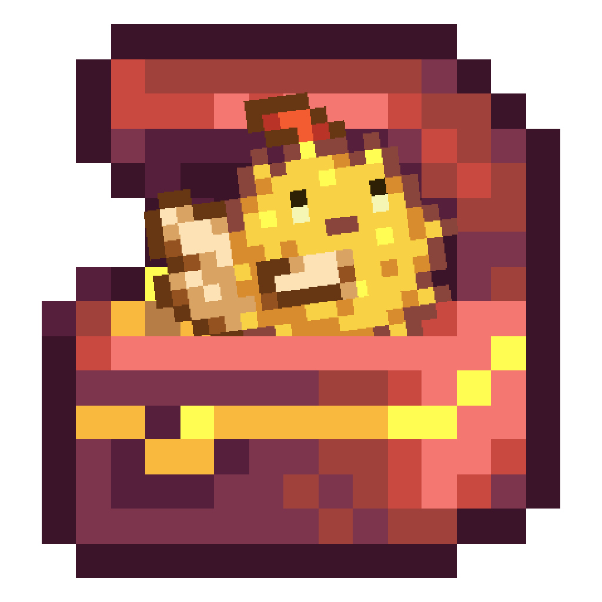

<!-- PROJECT SHIELDS -->
<!--
*** I'm using markdown "reference style" links for readability.
*** Reference links are enclosed in brackets [ ] instead of parentheses ( ).
*** See the bottom of this document for the declaration of the reference variables
*** for contributors-url, forks-url, etc. This is an optional, concise syntax you may use.
*** https://www.markdownguide.org/basic-syntax/#reference-style-links
-->
[![Contributors][contributors-shield]][contributors-url]
[![Forks][forks-shield]][forks-url]
[![Stargazers][stars-shield]][stars-url]
[![Issues][issues-shield]][issues-url]
[![MIT License][license-shield]][license-url]
[![LinkedIn][linkedin-shield]][linkedin-url]


<!-- PROJECT LOGO -->
<br />
<p align="center">
  <a href="https://github.com/noahbjohnson/smapi-manager">
    
  </a>

  <h3 align="center">SMAPI Mod Manager</h3>

  <p align="center">
    A cross-platform mod manager for Stardew Valley
    <br />
    <a href="https://github.com/noahbjohnson/smapi-manager"><strong>Explore the docs »</strong></a>
    <br />
  </p>
</p>


<!-- TABLE OF CONTENTS -->
## Table of Contents

* [About the Project](#about-the-project)
  * [Built With](#built-with)
* [Getting Started](#getting-started)
  * [Prerequisites](#prerequisites)
  * [Installation](#installation)
* [Usage](#usage)
* [Roadmap](#roadmap)
* [Contributing](#contributing)
* [License](#license)
* [Contact](#contact)
* [Acknowledgements](#acknowledgements)


<!-- ABOUT THE PROJECT -->
## About The Project

This project is in early development. Please see the roadmap for status updates.

<!-- [![Product Name Screen Shot][product-screenshot]](https://example.com) -->


### Built With

* [Wails](https://wails.app/)
* [React](https://reactjs.org/)
* [Go](https://golang.org/)
* [SMAPI](https://github.com/Pathoschild/SMAPI)


<!-- GETTING STARTED 
## Getting Started

To get a local copy up and running follow these simple steps.

### Prerequisites

This is an example of how to list things you need to use the software and how to install them.
* npm
```sh
npm install npm@latest -g
```

### Installation
 
1. Clone the smapi-manager
```sh
git clone https://github.com/noahbjohnson/smapi-manager.git
```
2. Install NPM packages
```sh
npm install
```

-->

<!-- USAGE EXAMPLES 
## Usage

Use this space to show useful examples of how a project can be used. Additional screenshots, code examples and demos work well in this space. You may also link to more resources.

_For more examples, please refer to the [Documentation](https://example.com)_

-->

<!-- ROADMAP -->
## Roadmap

See the [open issues](https://github.com/noahbjohnson/smapi-manager/issues) for a list of proposed features (and known issues).

<!-- CONTRIBUTING -->
## Contributing

Please open an issue or PR before diving in to prevent overlap.

1. Fork the Project
2. Create your Feature Branch (`git checkout -b feature/AmazingFeature`)
3. Commit your Changes (`git commit -m 'Add some AmazingFeature'`)
4. Push to the Branch (`git push origin feature/AmazingFeature`)
5. Open a Pull Request


<!-- LICENSE -->
## License

Distributed under the MIT License. See `LICENSE` for more information.

The template for this readme is ©2018 Othneil Drew, also MIT Licensed

<!-- CONTACT -->
## Contact

Noah B Johnson - [@iamnoahbjohnson](https://twitter.com/iamnoahbjohnson) - noah@noahbjohnson.net

Project Link: [https://github.com/noahbjohnson/smapi-manager](https://github.com/noahbjohnson/smapi-manager)


<!-- ACKNOWLEDGEMENTS 
## Acknowledgements

* []()
* []()
* []()
-->


<!-- MARKDOWN LINKS & IMAGES -->
<!-- https://www.markdownguide.org/basic-syntax/#reference-style-links -->
[contributors-shield]: https://img.shields.io/github/contributors/noahbjohnson/smapi-manager.svg?style=flat-square
[contributors-url]: https://github.com/noahbjohnson/smapi-manager/graphs/contributors
[forks-shield]: https://img.shields.io/github/forks/noahbjohnson/smapi-manager.svg?style=flat-square
[forks-url]: https://github.com/noahbjohnson/smapi-manager/network/members
[stars-shield]: https://img.shields.io/github/stars/noahbjohnson/smapi-manager.svg?style=flat-square
[stars-url]: https://github.com/noahbjohnson/smapi-manager/stargazers
[issues-shield]: https://img.shields.io/github/issues/noahbjohnson/smapi-manager.svg?style=flat-square
[issues-url]: https://github.com/noahbjohnson/smapi-manager/issues
[license-shield]: https://img.shields.io/github/license/noahbjohnson/smapi-manager.svg?style=flat-square
[license-url]: https://github.com/noahbjohnson/smapi-manager/blob/master/LICENSE
[linkedin-shield]: https://img.shields.io/badge/-LinkedIn-black.svg?style=flat-square&logo=linkedin&colorB=555
[linkedin-url]: https://linkedin.com/in/noahbjohnson
<!-- [product-screenshot]: images/screenshot.png -->
